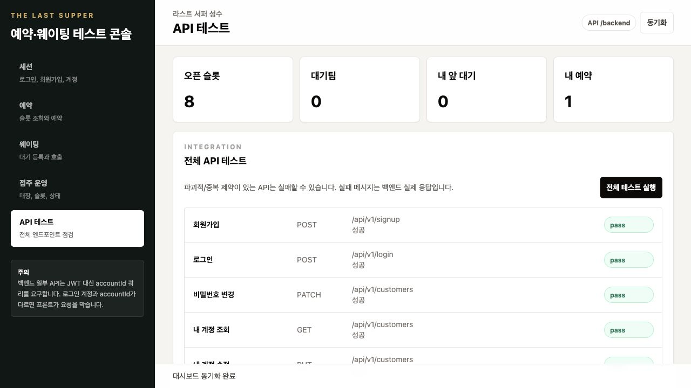
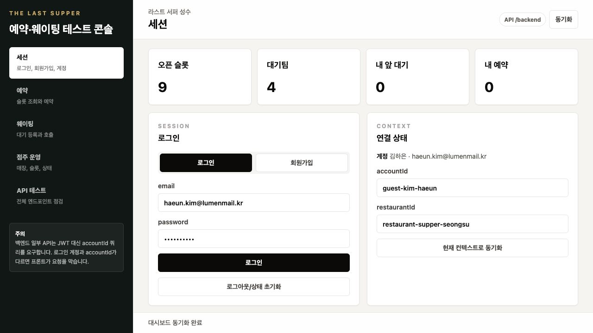
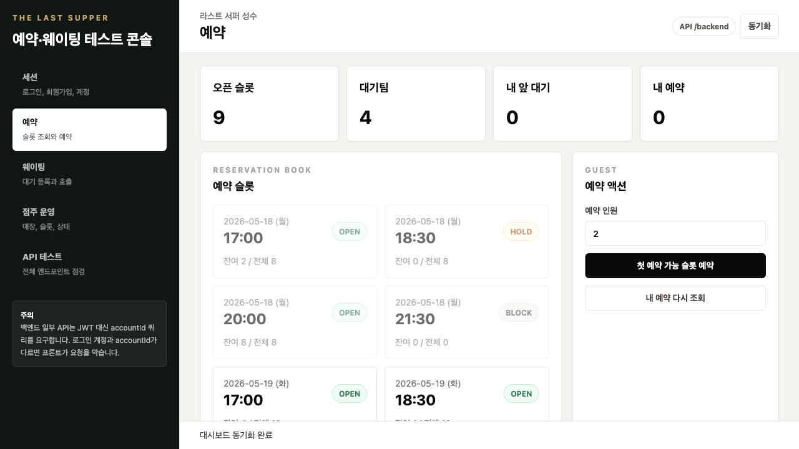
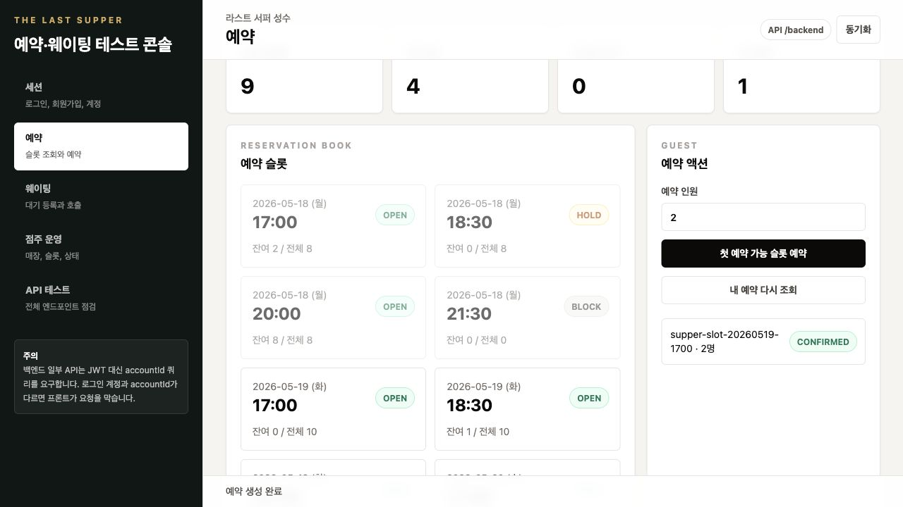
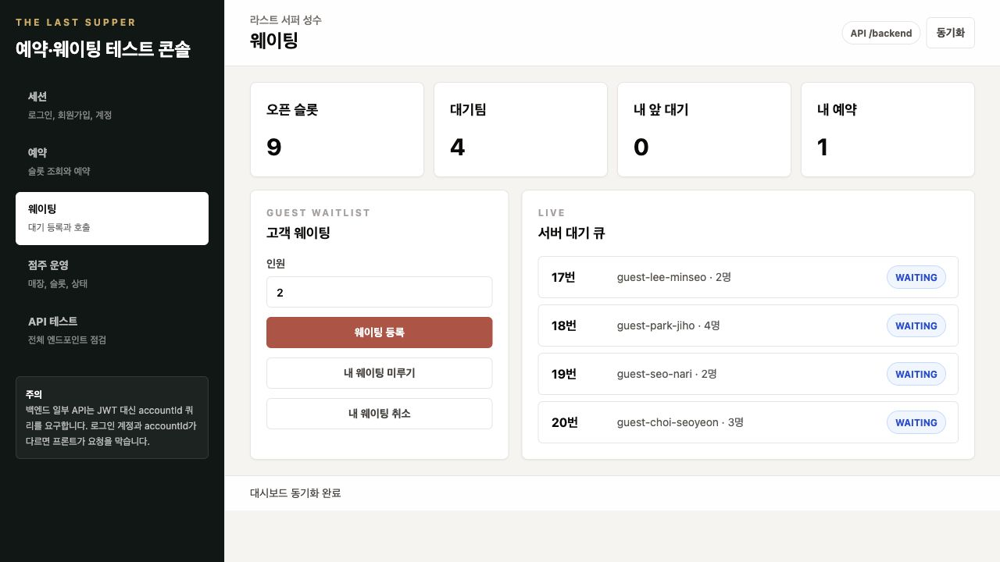
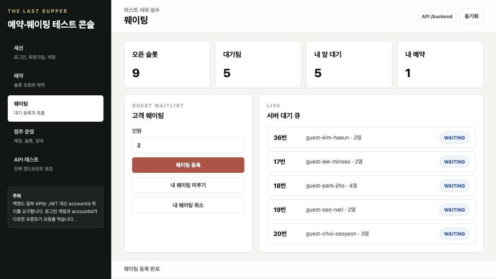
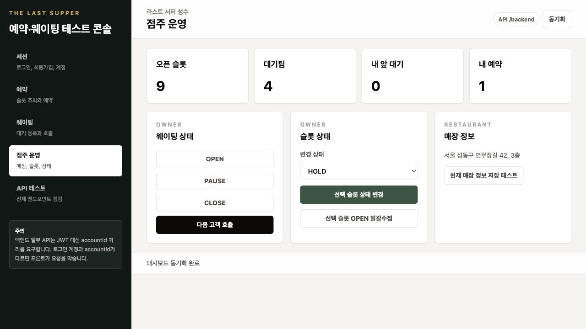
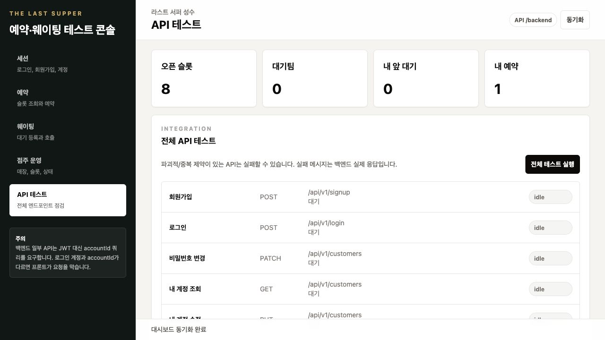

# The Last Supper Front

예약과 현장 웨이팅을 함께 운영하는 파인다이닝 레스토랑을 위한 프론트엔드 콘솔입니다.  
고객은 예약 슬롯을 조회하고 예약/웨이팅을 신청할 수 있고, 운영자는 웨이팅 상태와 예약 슬롯을 관리할 수 있습니다.



## 프로젝트 개요

The Last Supper Front는 백엔드 API 분석을 기반으로 제작한 React 단일 페이지 애플리케이션입니다. 단순 화면 목업이 아니라 실제 백엔드 서버와 연동해 로그인, 예약, 웨이팅, 점주 운영, API 통합 테스트를 실행할 수 있도록 구성했습니다.

- 백엔드 연동: `VITE_API_BASE_URL` 기반 API client
- 개발 서버: Vite proxy로 `/backend` 요청을 `http://127.0.0.1:8080`에 전달
- 테스트 데이터: `docs/demo-seed.sql`의 현실적인 시연 데이터 사용
- API 분석 문서: `docs/api-analysis.md`

## 주요 기능

### 세션

- 로그인 및 회원가입
- access token 저장 및 인증 요청
- 로그인 계정과 `accountId` 불일치 방어
- 백엔드가 account id를 응답하지 않는 신규 계정 케이스 안내



### 예약

- 기간별 예약 플랜/슬롯 조회
- 백엔드 정책에 맞춘 예약 가능 슬롯 필터링
- 예약 생성 및 내 예약 목록 확인
- 당일 만료 슬롯 예약 방지





### 웨이팅

- 현장 웨이팅 등록
- 내 앞 대기 위치 조회
- 웨이팅 미루기/취소
- 서버 대기 큐 실시간 확인





### 점주 운영

- 웨이팅 `OPEN`, `PAUSE`, `CLOSE` 전환
- 다음 고객 호출
- 예약 슬롯 상태 변경
- 슬롯 capacity/status 일괄 수정
- OWNER 권한이 필요한 매장 저장 요청의 권한 방어 확인




### API 테스트 랩

백엔드 Controller 기준으로 분석한 주요 API를 화면에서 순차 실행합니다.  
예약/웨이팅처럼 DB 상태에 따라 반복 실행 결과가 달라지는 API는 `pass`, `fail`, `skip`을 구분해 실제 장애와 비즈니스 전제조건 부족을 분리했습니다.

최종 브라우저 검증 결과:

- `24 pass`
- `3 skip`
- `0 fail`




## 기술 스택

| 영역 | 기술 |
| --- | --- |
| Framework | React 19 |
| Build Tool | Vite 7 |
| Language | TypeScript |
| Styling | Tailwind CSS |
| API | Fetch 기반 typed API client |
| Runtime | Node.js 20.20.2 |

## 폴더 구조

```txt
.
├── docs
│   ├── api-analysis.md
│   ├── demo-seed.sql
│   └── screenshots
├── src
│   ├── api
│   │   ├── client.ts
│   │   ├── mockData.ts
│   │   ├── theLastSupperApi.ts
│   │   └── types.ts
│   ├── App.tsx
│   ├── index.css
│   └── main.tsx
├── vite.config.ts
└── package.json
```

## 실행 방법

### 1. Node 버전 확인

```bash
node --version
```

권장 버전은 `.nvmrc`, `.node-version`에 맞춘 `20.20.2`입니다.

### 2. 의존성 설치

```bash
npm install
```

### 3. 환경 변수 설정

개발 환경에서는 `.env.development`에 다음 값이 설정되어 있습니다.

```env
VITE_API_BASE_URL=/backend
```

Vite proxy 설정은 `/backend`를 백엔드 서버 `http://127.0.0.1:8080`으로 전달합니다.

### 4. 개발 서버 실행

```bash
npm run dev
```

기본 접속 주소:

```txt
http://127.0.0.1:5173
```

## 시연 계정

`docs/demo-seed.sql` 적용 후 사용할 수 있는 기본 계정입니다.

| 역할 | Email | Password | accountId |
| --- | --- | --- | --- |
| 고객 | `haeun.kim@lumenmail.kr` | `Password1!` | `guest-kim-haeun` |
| 점주 | `seojin.yoon@lastsupper.kr` | `Password1!` | `owner-yoon-seojin` |

## API 연동 설계

- API base URL은 `VITE_API_BASE_URL`로 분리했습니다.
- 실제 API base URL이 있으면 mock fallback 없이 백엔드 오류를 화면에 노출합니다.
- API base URL이 비어 있으면 `src/api/mockData.ts`의 mock 데이터로 화면 확인이 가능합니다.
- access token은 `localStorage`에 저장하며, 인증 요청에는 `Authorization: Bearer {token}`을 붙입니다.
- refresh token 쿠키 연동을 고려해 모든 요청은 `credentials: "include"`로 전송합니다.

## 검증 내역

브라우저에서 각 페이지와 기능을 직접 실행해 확인했습니다.

| 페이지 | 검증 기능 | 결과 |
| --- | --- | --- |
| 세션 | 로그인, 컨텍스트 동기화 | 통과 |
| 예약 | 슬롯 조회, 예약 생성 | 통과 |
| 웨이팅 | 큐 조회, 등록, 취소 | 통과 |
| 점주 운영 | 웨이팅 상태 변경, 호출, 슬롯 수정 | 통과 |
| API 테스트 | 전체 API 랩 | `24 pass / 3 skip / 0 fail` |

빌드 검증:

```bash
npm run build
```

## 구현 중 발견하고 개선한 부분

- 로그인 계정 변경 후 이전 계정의 `accountId`가 남아 예약/웨이팅 요청에 섞이는 문제를 방어했습니다.
- KST 기준 날짜가 UTC 기준으로 하루 밀리는 문제를 수정했습니다.
- 백엔드 예약 정책상 당일 만료 슬롯은 예약 대상에서 제외되도록 프론트 필터를 보강했습니다.
- 반복 실행 시 이미 처리된 예약/웨이팅 API는 실패가 아니라 `skip`으로 분류해 테스트 결과를 읽기 쉽게 만들었습니다.

